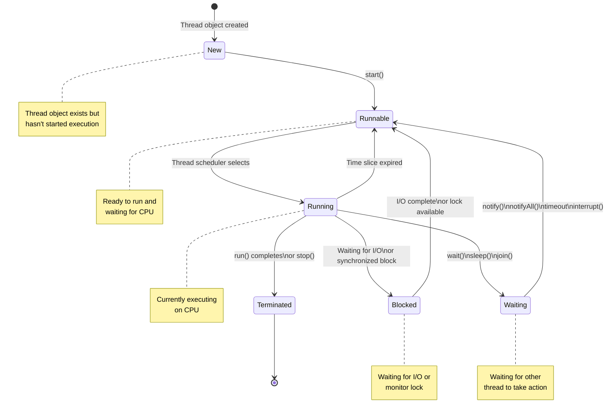

# Java Questions 
## Defensive Programming

**Defensive programming** is a software development technique that aims to anticipate and handle potential errors or unexpected situations within a program. It involves writing code that gracefully handles these issues to prevent program crashes, data corruption, or security vulnerabilities.

### Key Principles of Defensive Programming:

* **Input Validation:** Thoroughly check and validate all input data, including user input, data from files, and network communication. This helps prevent invalid or malicious data from compromising the program.
* **Error Handling:** Implement robust error handling mechanisms to gracefully handle exceptions and unexpected conditions. This includes using try-catch blocks, logging errors, and providing informative error messages.
* **Assertions:** Use assertions to check for conditions that should always be true within your code. Assertions help identify programming errors early in the development process.
* **Boundary Value Testing:** Test your code with data at the edges of valid input ranges to uncover potential issues.
* **Code Reviews and Testing:** Conduct thorough code reviews and testing to identify potential vulnerabilities and improve code quality.

### Benefits of Defensive Programming:

* **Increased reliability:** Programs are less likely to crash or behave unexpectedly.
* **Improved security:** Protects against vulnerabilities like injection attacks and buffer overflows.
* **Enhanced maintainability:** Code becomes easier to understand and modify.
* **Better user experience:** Provides informative error messages and graceful handling of unexpected situations.

### Example:

```java
public int divide(int numerator, int denominator) {
    if (denominator == 0) {
        throw new IllegalArgumentException("Denominator cannot be zero");
    }
    return numerator / denominator;
}
```

In this example, defensive programming is used to prevent division by zero by checking the denominator and throwing an exception if it's zero.

**Remember:** While defensive programming is essential, it's important to strike a balance between defensive coding and performance. Overly defensive code can sometimes lead to decreased efficiency.

By adopting defensive programming practices, you can significantly improve the quality, reliability, and security of your software applications.
 
**Would you like to see examples of defensive programming in specific programming languages or scenarios?**

## Programming Against Interfaces

**Programming against interfaces** is a fundamental principle in object-oriented programming that emphasizes using interfaces or abstract classes instead of concrete implementations when writing code.

### What does it mean?

* **Focus on behavior, not implementation:** Your code should interact with objects based on what they *can do* (the interface), rather than how they do it (the implementation).
* **Loose coupling:** This approach promotes loose coupling between classes, making your code more flexible, reusable, and testable.
* **Dependency inversion:** It aligns with the dependency inversion principle (one of the SOLID principles), which suggests that high-level modules should not depend on low-level modules; both should depend on abstractions.

### Why is it important?

* **Increased flexibility:** If the concrete implementation changes, as long as it adheres to the interface, your code will still work without modifications.
* **Improved testability:** You can easily create mock or stub implementations of interfaces for testing purposes.
* **Enhanced reusability:** Components that use interfaces can be easily reused in different contexts.
* **Better maintainability:** Changes to implementations have less impact on other parts of the system.

### Example:

Let's consider a simple example using Java:

```java
interface Shape {
    double calculateArea();
}

class Circle implements Shape {
    private double radius;

    // ... constructor and other methods

    public double calculateArea() {
        return Math.PI * radius * radius;
    }
}

class Rectangle implements Shape {
    private double width, height;

    // ... constructor and other methods

    public double calculateArea() {
        return width * height;
    }
}

class AreaCalculator {
    public double calculateTotalArea(List<Shape> shapes) {
        double totalArea = 0;
        for (Shape shape : shapes) {
            totalArea += shape.calculateArea();
        }
        return totalArea;
    }
}
```

In this example, `AreaCalculator` depends on the `Shape` interface, not specific implementations like `Circle` or `Rectangle`. This allows you to add new shapes (implementing the `Shape` interface) without modifying the `AreaCalculator` class.

**Key points to remember:**

* While programming against interfaces is generally recommended, there might be situations where using concrete classes is appropriate, such as performance optimization or when the implementation details are tightly coupled to the specific use case.
* It's essential to balance the benefits of loose coupling with potential performance implications.

Tightly and loosely coupled systems refer to the degree of interdependence between components in a system, often in the context of software architecture or computer systems. Here’s a breakdown of the two concepts:

### Tightly Coupled Systems

- **High Interdependence:** Components in a tightly coupled system are highly dependent on each other. Changes in one component often require changes in others.
- **Direct Communication:** Components directly communicate with each other, often through explicit interfaces or function calls.
- **Low Modularity:** The system is less modular, making it harder to isolate components for testing or maintenance.
- **Performance:** Tightly coupled systems can have better performance in some cases because components can be optimized to work closely together.
- **Flexibility and Scalability:** These systems are less flexible and scalable because modifying or extending the system can be challenging.

### Loosely Coupled Systems

- **Low Interdependence:** Components in a loosely coupled system have minimal dependencies on each other. They interact through well-defined interfaces or message passing.
- **Indirect Communication:** Communication between components is often indirect, using intermediaries such as message brokers or APIs.
- **High Modularity:** The system is more modular, making it easier to isolate, test, and maintain components.
- **Flexibility and Scalability:** These systems are more flexible and scalable. New components can be added or existing ones modified with minimal impact on the rest of the system.
- **Performance:** While loosely coupled systems might have performance overhead due to the extra layers of communication, they often provide greater overall system robustness and adaptability.

### Examples

- **Tightly Coupled System Example:** A monolithic application where different modules or classes are directly interdependent and rely on shared states or variables.
- **Loosely Coupled System Example:** A microservices architecture where services communicate over a network using APIs or message queues, each service being independent and self-contained.

In summary, tightly coupled systems are characterized by strong interdependencies between components, which can lead to higher performance but lower flexibility. Loosely coupled systems, on the other hand, prioritize modularity and flexibility, facilitating easier maintenance and scalability at the potential cost of some performance efficiency.

By following the principle of programming against interfaces, you can create more adaptable, maintainable, and testable software systems.
 
**Would you like to see an example of how programming against interfaces can improve code testability?**

## Interfaces vs. Abstract Classes

**Imagine you're building a car.**

### Abstract Class:
Think of an abstract class as a blueprint for a specific type of car, like a "Sedan". It provides a basic structure and some common parts (methods), but you can still customize it (add specific features).

* **Can have both abstract and concrete methods.**
* **Can have variables (fields).**
* **Supports single inheritance.**
* **Used when you want to provide a common base class with some implementation details.**

**Example:**

```java
abstract class Sedan {
    int numberOfDoors = 4; // Common property

    void startEngine() { // Concrete method
        System.out.println("Sedan engine started");
    }

    abstract void accelerate(); // Abstract method, must be implemented by subclasses
}
```

### Interface:
Think of an interface as a contract that defines what a car *must* have or be able to do, like having wheels and being able to move. It doesn't specify how these features are implemented.

* **Contains only abstract methods.**
* **Can't have variables (fields).**
* **Supports multiple inheritance.**
* **Used when you want to define a standard behavior without providing implementation details.**

**Example:**
```java
interface Vehicle {
    void start();
    void stop();
}
```

**Key Differences:**

| Feature | Abstract Class | Interface |
|---|---|---|
| Methods | Can have both abstract and concrete | Only abstract methods |
| Variables | Can have variables | Can have only static final variables |
| Inheritance | Single inheritance | Multiple inheritance |
| Implementation | Provides some implementation | No implementation |

**When to use which:**

* **Abstract Class:** When you want to share code among related classes, provide a default implementation, and allow subclasses to override or extend methods.
* **Interface:** When you want to define a common behavior for unrelated classes, achieve polymorphism, or support multiple inheritance.

**Remember:** Both abstract classes and interfaces are used for abstraction, but they serve different purposes. Choosing the right one depends on your specific design requirements.

**Would you like to see an example of how to use interfaces and abstract classes in a practical scenario?**

## JDK vs. JRE: A Breakdown for Software Engineers

### JDK (Java Development Kit)
Think of the JDK as a comprehensive toolbox for Java developers. It provides everything you need to create, compile, debug, and execute Java applications. Key components include:

* **Compiler (javac):** Translates Java source code into bytecode.
* **Debugger:** Helps identify and fix errors in your code.
* **JVM (Java Virtual Machine):** Executes bytecode.
* **Class libraries:** Pre-written code for common tasks.
* **Other tools:** For documentation generation, packaging, and more.

Essentially, the JDK is a superset of the JRE with additional development tools.

### JRE (Java Runtime Environment)
The JRE is the minimum requirement to run Java applications. It's like the engine of a car; it doesn't build the car, but it's essential for it to operate. Key components include:

* **JVM (Java Virtual Machine):** Executes bytecode.
* **Class libraries:** Provides core functionalities for applications.

In simpler terms, the JRE is a subset of the JDK, focusing solely on the runtime aspects.

### Key Differences
| Feature | JDK | JRE |
|---|---|---|
| Purpose | Development | Execution |
| Components | Compiler, debugger, JVM, class libraries, tools | JVM, class libraries |
| Usage | Developers | End-users |

**To summarize:**

* **If you want to develop Java applications**, you need the JDK.
* **If you only want to run Java applications**, you need the JRE.

**Analogy:** Imagine building a house. The JDK is the set of tools, blueprints, and materials you need to construct the house. The JRE is the foundation and infrastructure that allows people to live in the house once it's built.

**In essence,** the JDK empowers developers to create Java applications, while the JRE enables those applications to run on different platforms.
 
**Would you like to delve deeper into a specific aspect of JDK or JRE?** 

Coding Example of OOPS

Certainly, I'll rewrite the example in Java. Here's the equivalent Object-Oriented Programming example using Java syntax:

```java
// Abstract base class
abstract class Animal {
    protected String name;

    public Animal(String name) {
        this.name = name;
    }

    // Abstract method to be implemented by subclasses
    public abstract String speak();
}

// Dog subclass
class Dog extends Animal {
    public Dog(String name) {
        super(name);
    }

    @Override
    public String speak() {
        return this.name + " says Woof!";
    }
}

// Cat subclass
class Cat extends Animal {
    public Cat(String name) {
        super(name);
    }

    @Override
    public String speak() {
        return this.name + " says Meow!";
    }
}

// Main class to demonstrate the usage
public class Main {
    public static void main(String[] args) {
        // Creating objects
        Animal dog = new Dog("Buddy");
        Animal cat = new Cat("Whiskers");

        // Using polymorphism
        System.out.println(dog.speak());  // Output: Buddy says Woof!
        System.out.println(cat.speak());  // Output: Whiskers says Meow!
    }
}
```

This Java example demonstrates the same OOP concepts as the Python version:

1. Classes and Objects: We define `Animal`, `Dog`, and `Cat` classes and create objects of these classes.

2. Encapsulation: The `name` attribute is protected and accessed through methods.

3. Inheritance: `Dog` and `Cat` inherit from `Animal`.

4. Polymorphism: The `speak()` method is overridden in subclasses and can be called on `Animal` references.

5. Abstraction: `Animal` is an abstract class with an abstract `speak()` method.

Key differences from the Python version:

- Java uses explicit type declarations.
- The `abstract` keyword is used for the base class and method.
- Method overriding is explicitly marked with the `@Override` annotation.
- Constructor chaining is done using `super()`.
- The `main` method is required to run the program.

Would you like me to explain any part of this Java implementation in more detail?

Strings are immutable in Java for several important reasons:

1. Security: Immutability ensures that string values cannot be changed after creation, which is crucial for sensitive data like passwords or network connections.

2. Performance: 
   - String pool optimization: Java can reuse string literals, saving memory.
   - Hashcode caching: The hashcode of an immutable string can be cached, improving performance in hash-based collections.

3. Thread safety: Immutable strings are inherently thread-safe, eliminating the need for synchronization in multi-threaded environments.

4. Simplicity: Immutability simplifies the use of strings as keys in hash-based data structures.

5. Caching: Results of string operations can be safely cached without worrying about future modifications.

These design choices help make Java more efficient and less error-prone in many common use cases.

Would you like me to elaborate on any of these points or discuss how Java implements string immutability?

Let me explain the different thread states in Java with a clear diagram and explanation.




Let me explain each thread state and the transitions between them:

1. **New**
   - Initial state when a Thread object is created
   - Thread exists but hasn't started executing yet

2. **Runnable**
   - Thread is ready to run and is waiting for CPU
   - Moves to this state when start() is called
   - Can return to this state from Running when time slice expires

3. **Running**
   - Thread is currently executing on CPU
   - Selected from Runnable pool by thread scheduler
   - Can transition to several other states:
     - Blocked (for I/O or locks)
     - Waiting (via wait(), sleep(), or join())
     - Terminated (when done)

4. **Blocked**
   - Thread is waiting for I/O to complete
   - Or waiting to acquire a synchronized lock
   - Returns to Runnable when resource becomes available

5. **Waiting**
   - Thread is waiting for another thread to perform an action
   - Enters this state through:
     - wait()
     - sleep()
     - join()
   - Returns to Runnable through:
     - notify()
     - notifyAll()
     - Timeout
     - interrupt()

6. **Terminated**
   - Thread has completed its execution
   - Either naturally (run() completed)
   - Or through stop() method (deprecated)

Would you like me to explain any particular state transitions in more detail or provide example code showing how to transition between specific states?

Deploying Java Programes 
Here's a step-by-step guide to deploying a Java application from IntelliJ as a JAR file:

1. **Set Up Your Project**:
   - Open your Java project in IntelliJ IDEA.
   - Ensure that your code is working as expected.

2. **Add an Artifact**:
   - Go to **File > Project Structure** or press `Ctrl + Shift + Alt + S`.
   - Select the **Artifacts** section on the left.
   - Click the **+** button, choose **JAR > From modules with dependencies**.
   - Select the main class (the class with the `main` method) and click **OK**.
   - In the **Output Layout** tab, ensure your JAR includes the necessary libraries. By default, IntelliJ will include dependencies if you selected "With dependencies" in the previous step.

3. **Set Up a Build Configuration**:
   - Go to **Build > Build Artifacts**.
   - Find the artifact you just created and select **Build**. This will compile your application and package it into a JAR file.

4. **Locate the JAR File**:
   - The JAR file will typically be in the `out/artifacts/` directory within your project folder. You can find it by navigating to the **Project** window in IntelliJ and expanding the **out** folder.

5. **Run the JAR File**:
   - Open a terminal or command prompt.
   - Navigate to the directory where your JAR file is located.
   - Run the JAR file with the command:
     ```bash
     java -jar yourfile.jar
     ```
     Replace `yourfile.jar` with the actual name of your JAR file.

6. **(Optional) Watch a Tutorial**:
   - For a video demonstration of deploying a Java application as a JAR file from IntelliJ, check out [this tutorial](https://youtu.be/aYQLZYRJmwg).

This should give you a standalone JAR file for your Java application that you can run on any system with Java installed.


Let me explain coupling in object-oriented programming concisely.

Coupling measures how dependent one class is on another class. It's essentially about how much one class needs to know about another class to function.

There are two main types:

1. Tight/High Coupling
- Classes are heavily dependent on each other
- Changes in one class likely require changes in another
- Example:
```java
class Order {
    private Customer customer;
    
    public void processOrder() {
        customer.updatePurchaseHistory();
        customer.deductBalance();
        customer.sendEmailConfirmation();
    }
}
```

2. Loose/Low Coupling
- Classes are more independent
- Changes in one class rarely affect others
- Often achieved through interfaces or abstract classes
- Example:
```java
interface PaymentProcessor {
    void processPayment();
}

class Order {
    private PaymentProcessor paymentProcessor;
    
    public void checkout() {
        paymentProcessor.processPayment();
    }
}
```

Low coupling is generally preferred as it makes code:
- More maintainable
- Easier to test
- More flexible to changes
- More reusable

Would you like me to elaborate on specific techniques for achieving loose coupling?

The Object class in Java is the root/parent class of all Java classes. Here's a concise explanation:

Key points about Object class:

1. Located in java.lang package and automatically imported
2. Every class implicitly extends Object if it doesn't extend any other class

Important methods from Object class:

```java
public class Example {
    public static void main(String[] args) {
        Object obj = new Object();
        
        // Common Object class methods:
        obj.toString();      // Returns string representation
        obj.equals(obj);     // Compares objects for equality
        obj.hashCode();      // Returns hash code value
        obj.getClass();      // Returns runtime class
        obj.clone();         // Creates and returns copy
        obj.notify();        // Wakes up single thread
        obj.notifyAll();     // Wakes up all threads
        obj.wait();          // Makes thread wait
    }
}
```

Common uses and overrides:

1. toString() - Customizing string representation:
```java
class Student {
    private String name;
    private int id;
    
    @Override
    public String toString() {
        return "Student[name=" + name + ", id=" + id + "]";
    }
}
```

2. equals() - Custom equality comparison:
```java
class Student {
    private int id;
    
    @Override
    public boolean equals(Object obj) {
        if (obj == null || getClass() != obj.getClass())
            return false;
        Student other = (Student) obj;
        return this.id == other.id;
    }
}
```

3. hashCode() - Usually overridden with equals():
```java
class Student {
    private int id;
    
    @Override
    public int hashCode() {
        return Objects.hash(id);
    }
}
```

These methods are essential for:
- Collections framework operations
- Synchronization (wait/notify)
- Object comparison and identification
- Debugging and logging

Would you like me to elaborate on any specific method or use case?

Wrapper classes in Java are used to convert primitive data types into objects. Here's a comprehensive explanation:

1. Basic Wrapper Classes:
```java
// Primitive -> Wrapper
byte -> Byte
short -> Short
int -> Integer
long -> Long
float -> Float
double -> Double
char -> Character
boolean -> Boolean
```

2. Creating Wrapper Objects:
```java
// Three ways to create wrapper objects
Integer num1 = new Integer(5);        // Deprecated
Integer num2 = Integer.valueOf(5);     // Preferred - uses caching
Integer num3 = 5;                      // Auto-boxing

// Unwrapping
int primitive = num3.intValue();       // Explicit unboxing
int primitive2 = num3;                 // Auto-unboxing
```

3. Useful Methods:
```java
public class WrapperDemo {
    public static void main(String[] args) {
        // Parsing methods
        int i = Integer.parseInt("100");
        double d = Double.parseDouble("3.14");
        
        // Conversion methods
        String binary = Integer.toBinaryString(10);    // "1010"
        String hex = Integer.toHexString(16);          // "10"
        
        // Constants
        System.out.println(Integer.MAX_VALUE);         // 2147483647
        System.out.println(Integer.MIN_VALUE);         // -2147483648
        
        // Comparison
        Integer x = 128;
        Integer y = 128;
        System.out.println(x == y);      // false (outside cache range)
        System.out.println(x.equals(y));  // true
    }
}
```

4. Auto-boxing and Unboxing:
```java
public class AutoboxingDemo {
    public static void main(String[] args) {
        // Autoboxing
        ArrayList<Integer> list = new ArrayList<>();
        list.add(5);  // automatically converts int to Integer
        
        // Auto-unboxing
        int sum = 0;
        for(Integer num : list) {
            sum += num;  // automatically converts Integer to int
        }
    }
}
```

5. Important Considerations:
- Cache Pool (-128 to 127 for Integer)
```java
Integer a = 127;
Integer b = 127;
System.out.println(a == b);      // true (within cache)

Integer c = 128;
Integer d = 128;
System.out.println(c == d);      // false (outside cache)
```

Key benefits of Wrapper Classes:
1. Allow primitives to be used in Collections
2. Provide useful utility methods
3. Enable null values for primitives
4. Support generic type parameters

Remember:
- Use equals() for comparison, not ==
- Prefer valueOf() over new constructor
- Be aware of autoboxing performance implications in loops

Would you like me to elaborate on any specific aspect of wrapper classes?

The toString() method in Java is used to get a string representation of an object. Let me explain with examples:

1. Default toString():
```java
class SimpleClass {
    int id = 1;
    // Without overriding toString()
    public static void main(String[] args) {
        SimpleClass obj = new SimpleClass();
        System.out.println(obj); // Output: SimpleClass@7852e922
    }
}
```

2. Overriding toString():
```java
class Student {
    private String name;
    private int id;
    
    public Student(String name, int id) {
        this.name = name;
        this.id = id;
    }
    
    @Override
    public String toString() {
        return "Student [name=" + name + ", id=" + id + "]";
    }
}
```

3. Common Use Cases:

```java
public class ToStringExample {
    public static void main(String[] args) {
        // Arrays toString
        int[] numbers = {1, 2, 3};
        System.out.println(Arrays.toString(numbers));  // [1, 2, 3]
        
        // StringBuilder
        StringBuilder sb = new StringBuilder();
        sb.append("Hello").append(" World");
        System.out.println(sb.toString());  // Hello World
        
        // ArrayList
        ArrayList<String> list = new ArrayList<>();
        list.add("Apple");
        list.add("Banana");
        System.out.println(list.toString());  // [Apple, Banana]
    }
}
```

4. Best Practices:
```java
class Person {
    private String name;
    private int age;
    private String email;
    
    @Override
    public String toString() {
        return String.format("Person[name=%s, age=%d, email=%s]", 
            name, age, email);
            
        // Or using StringBuilder
        return new StringBuilder()
            .append("Person[")
            .append("name=").append(name)
            .append(", age=").append(age)
            .append(", email=").append(email)
            .append("]")
            .toString();
    }
}
```

5. Using Objects.toString():
```java
class Employee {
    private String name;
    private Integer salary;  // Could be null
    
    @Override
    public String toString() {
        return "Employee[name=" + 
               Objects.toString(name, "Unknown") + 
               ", salary=" + 
               Objects.toString(salary, "0") + 
               "]";
    }
}
```

Key points about toString():
1. Automatically called when object is printed
2. Used for debugging and logging
3. Should include important field values
4. Should be concise yet informative
5. Should handle null values appropriately

Common use cases:
- Debugging
- Logging
- String concatenation
- Display object state
- Data export

Would you like me to elaborate on any specific aspect of toString()?

Let me explain Java Access Modifiers comprehensively:

There are 4 types of access modifiers in Java:

1. Public:
```java
public class PublicExample {
    public String name;     // Accessible everywhere
    public void method() {
        // Accessible from any class
    }
}
```

2. Private:
```java
public class PrivateExample {
    private String name;    // Only accessible within this class
    
    private void method() {
        // Only accessible within this class
    }
    
    // Getter/Setter for private fields
    public String getName() {
        return name;
    }
}
```

3. Protected:
```java
public class Parent {
    protected String name;  // Accessible in same package and subclasses
    
    protected void method() {
        // Accessible in same package and subclasses
    }
}

class Child extends Parent {
    void accessParent() {
        System.out.println(name);    // Can access protected member
        method();                    // Can access protected method
    }
}
```

4. Default (Package-Private):
```java
class DefaultExample {     // No modifier = default
    String name;          // Accessible only within same package
    
    void method() {       // Accessible only within same package
        // Package-private method
    }
}
```

Real-world Example:
```java
// File: Person.java
public class Person {
    private String name;           // Private - data encapsulation
    private int age;              // Private - data encapsulation
    protected String address;      // Protected - accessible by subclasses
    String email;                 // Default - package access
    public String phoneNumber;     // Public - open access
    
    // Public constructor
    public Person(String name, int age) {
        this.name = name;
        this.age = age;
    }
    
    // Private helper method
    private void validate() {
        // Internal validation logic
    }
    
    // Protected method for inheritance
    protected void updateAddress(String newAddress) {
        this.address = newAddress;
    }
    
    // Public interface methods
    public String getName() {
        return name;
    }
    
    public void setName(String name) {
        validate();
        this.name = name;
    }
}
```

Access Levels Table:
```
Modifier    | Class | Package | Subclass | World
------------|-------|---------|----------|-------
public      |   Y   |    Y    |    Y     |   Y
protected   |   Y   |    Y    |    Y     |   N
default     |   Y   |    Y    |    N     |   N
private     |   Y   |    N    |    N     |   N
```

Common Use Cases:

1. Data Encapsulation:
```java
public class BankAccount {
    private double balance;    // Private field
    
    public void deposit(double amount) {
        if (amount > 0) {
            balance += amount;
        }
    }
}
```

2. Inheritance:
```java
public class Vehicle {
    protected int speed;    // Accessible by subclasses
    
    protected void accelerate() {
        speed += 10;
    }
}

class Car extends Vehicle {
    void speedUp() {
        accelerate();      // Can access protected method
        speed += 5;        // Can access protected field
    }
}
```

Best Practices:
1. Make fields private unless there's a good reason not to
2. Use protected for members that subclasses need to access
3. Use public only for methods that form your class's API
4. Use default access only when you want to restrict access to the package

Would you like me to elaborate on any specific aspect of access modifiers?

Let me explain Dependency Injection (DI) with clear examples:

https://youtu.be/AbJpKhJVPt4
https://youtu.be/07smikVqNCc
https://youtu.be/gHQSQneKnhM

Dependency Injection is a design pattern where objects get their dependencies from external sources rather than creating them internally.

1. Without Dependency Injection (Bad Practice):
```java
class EmailService {
    public void sendEmail(String message) {
        // Send email logic
    }
}

class UserService {
    private EmailService emailService;
    
    public UserService() {
        // Creating dependency inside - tightly coupled
        this.emailService = new EmailService();
    }
    
    public void registerUser() {
        // User registration logic
        emailService.sendEmail("Welcome!");
    }
}
```

2. With Constructor Injection:
```java
interface MessageService {
    void sendMessage(String message);
}

class EmailService implements MessageService {
    @Override
    public void sendMessage(String message) {
        // Email sending logic
    }
}

class SMSService implements MessageService {
    @Override
    public void sendMessage(String message) {
        // SMS sending logic
    }
}

class UserService {
    private final MessageService messageService;
    
    // Dependency injected through constructor
    public UserService(MessageService messageService) {
        this.messageService = messageService;
    }
    
    public void registerUser() {
        // User registration logic
        messageService.sendMessage("Welcome!");
    }
}

// Usage
MessageService emailService = new EmailService();
UserService userService = new UserService(emailService);
```

3. Setter Injection:
```java
class UserService {
    private MessageService messageService;
    
    // Dependency injected through setter
    public void setMessageService(MessageService messageService) {
        this.messageService = messageService;
    }
    
    public void registerUser() {
        messageService.sendMessage("Welcome!");
    }
}
```

4. Field Injection (using Spring framework):
```java
@Service
class UserService {
    @Autowired
    private MessageService messageService;
    
    public void registerUser() {
        messageService.sendMessage("Welcome!");
    }
}
```

5. Real-world Example with Spring:
```java
// Repository layer
@Repository
public class UserRepository {
    public void save(User user) {
        // Database operations
    }
}

// Service layer
@Service
public class UserService {
    private final UserRepository userRepository;
    private final MessageService messageService;
    
    @Autowired
    public UserService(UserRepository userRepository, 
                      MessageService messageService) {
        this.userRepository = userRepository;
        this.messageService = messageService;
    }
    
    public void registerUser(User user) {
        userRepository.save(user);
        messageService.sendMessage("User registered: " + user.getEmail());
    }
}

// Controller layer
@RestController
public class UserController {
    private final UserService userService;
    
    @Autowired
    public UserController(UserService userService) {
        this.userService = userService;
    }
    
    @PostMapping("/users")
    public void createUser(@RequestBody User user) {
        userService.registerUser(user);
    }
}
```

Benefits of Dependency Injection:
1. Loose coupling
2. Easier testing (can mock dependencies)
3. More flexible code
4. Better separation of concerns
5. Easier maintenance

Common DI Frameworks:
1. Spring
2. Google Guice
3. Dagger
4. Java EE CDI

Testing Example with DI:
```java
class UserServiceTest {
    @Mock
    private MessageService messageService;
    
    @InjectMocks
    private UserService userService;
    
    @Test
    void testRegisterUser() {
        // Arrange
        User user = new User("test@email.com");
        
        // Act
        userService.registerUser(user);
        
        // Assert
        verify(messageService).sendMessage(anyString());
    }
}
```

Would you like me to elaborate on any specific aspect of Dependency Injection?

There are three main types of Dependency Injection. Let me explain each with examples:

1. Constructor Injection:
```java
// Constructor Injection Example
class UserService {
    private final EmailService emailService;
    private final LoggerService loggerService;
    
    // Dependencies injected through constructor
    public UserService(EmailService emailService, LoggerService loggerService) {
        this.emailService = emailService;
        this.loggerService = loggerService;
    }
    
    public void registerUser(String email) {
        loggerService.log("Registering user: " + email);
        emailService.sendWelcomeEmail(email);
    }
}

// Usage
EmailService emailService = new EmailService();
LoggerService loggerService = new LoggerService();
UserService userService = new UserService(emailService, loggerService);
```

2. Setter Injection:
```java
// Setter Injection Example
class UserService {
    private EmailService emailService;
    private LoggerService loggerService;
    
    // Dependencies injected through setters
    public void setEmailService(EmailService emailService) {
        this.emailService = emailService;
    }
    
    public void setLoggerService(LoggerService loggerService) {
        this.loggerService = loggerService;
    }
    
    public void registerUser(String email) {
        loggerService.log("Registering user: " + email);
        emailService.sendWelcomeEmail(email);
    }
}

// Usage
UserService userService = new UserService();
userService.setEmailService(new EmailService());
userService.setLoggerService(new LoggerService());
```

3. Field (Interface) Injection:
```java
// Field Injection Example (using Spring)
@Service
class UserService {
    @Autowired
    private EmailService emailService;
    
    @Autowired
    private LoggerService loggerService;
    
    public void registerUser(String email) {
        loggerService.log("Registering user: " + email);
        emailService.sendWelcomeEmail(email);
    }
}
```

Real-world Example with all types:
```java
// Dependencies
interface MessageService {
    void sendMessage(String msg);
}

interface LogService {
    void log(String msg);
}

interface CacheService {
    void cache(String key, Object value);
}

// Implementation with all types of injection
@Service
class CompleteService {
    // Field Injection
    @Autowired
    private CacheService cacheService;
    
    private final MessageService messageService;
    private LogService logService;
    
    // Constructor Injection
    @Autowired
    public CompleteService(MessageService messageService) {
        this.messageService = messageService;
    }
    
    // Setter Injection
    @Autowired
    public void setLogService(LogService logService) {
        this.logService = logService;
    }
    
    public void doSomething(String data) {
        logService.log("Processing: " + data);
        messageService.sendMessage(data);
        cacheService.cache("key", data);
    }
}
```

Comparison of DI Types:

1. Constructor Injection:
- Advantages:
```java
// 1. Ensures required dependencies
// 2. Supports immutability
// 3. Clear dependencies
class Service {
    private final Dependency dependency;
    
    public Service(Dependency dependency) {
        this.dependency = dependency;
    }
}
```

2. Setter Injection:
- Advantages:
```java
// 1. Optional dependencies
// 2. Can change dependencies
class Service {
    private Dependency dependency;
    
    public void setDependency(Dependency dependency) {
        this.dependency = dependency;
    }
}
```

3. Field Injection:
- Advantages:
```java
// 1. Less boilerplate code
// 2. Easy to add dependencies
@Service
class Service {
    @Autowired
    private Dependency dependency;
}
```

Best Practices:
1. Prefer Constructor Injection for required dependencies
2. Use Setter Injection for optional dependencies
3. Avoid Field Injection in production code
4. Use interfaces for dependencies
5. Follow SOLID principles

Would you like me to elaborate on any specific type or aspect of Dependency Injection?

Let me explain Dependency Injection (DI) in a simple way with easy examples:

Think of Dependency Injection like ordering a pizza:

1. Without DI (Bad Way):
```java
class Pizza {
    private Cheese cheese;  // ingredient
    private Dough dough;    // ingredient
    
    public Pizza() {
        // Pizza making its own ingredients - not flexible!
        this.cheese = new Cheese();
        this.dough = new Dough();
    }
}
```

2. With DI (Good Way):
```java
class Pizza {
    private Cheese cheese;
    private Dough dough;
    
    // Restaurant provides (injects) the ingredients
    public Pizza(Cheese cheese, Dough dough) {
        this.cheese = cheese;
        this.dough = dough;
    }
}
```

Now, let's look at the three types of Dependency Injection with a real example of a `NotificationService`:

1. Constructor Injection (Most Common):
```java
// Example with Email Service
class NotificationService {
    private EmailService emailService;
    
    // Dependencies are provided through constructor
    public NotificationService(EmailService emailService) {
        this.emailService = emailService;
    }
    
    public void sendNotification(String user, String message) {
        emailService.sendEmail(user, message);
    }
}

// Usage
EmailService emailService = new EmailService();
NotificationService service = new NotificationService(emailService);
service.sendNotification("john@email.com", "Hello!");
```

2. Setter Injection:
```java
class NotificationService {
    private EmailService emailService;
    
    // Dependencies are provided through setter methods
    public void setEmailService(EmailService emailService) {
        this.emailService = emailService;
    }
    
    public void sendNotification(String user, String message) {
        emailService.sendEmail(user, message);
    }
}

// Usage
NotificationService service = new NotificationService();
service.setEmailService(new EmailService());
service.sendNotification("john@email.com", "Hello!");
```

3. Field Injection (Using Spring Framework):
```java
@Service
class NotificationService {
    @Autowired  // Spring automatically provides the dependency
    private EmailService emailService;
    
    public void sendNotification(String user, String message) {
        emailService.sendEmail(user, message);
    }
}
```

Real World Example - A User Registration System:
```java
// Service interfaces
interface EmailService {
    void sendEmail(String to, String content);
}

interface UserDatabase {
    void saveUser(User user);
}

// Implementations
class SimpleEmailService implements EmailService {
    @Override
    public void sendEmail(String to, String content) {
        System.out.println("Sending email to: " + to);
    }
}

class MySQLDatabase implements UserDatabase {
    @Override
    public void saveUser(User user) {
        System.out.println("Saving user to MySQL: " + user.getName());
    }
}

// Main service using Constructor Injection
class UserRegistrationService {
    private final EmailService emailService;
    private final UserDatabase userDatabase;
    
    // Constructor Injection
    public UserRegistrationService(EmailService emailService, 
                                 UserDatabase userDatabase) {
        this.emailService = emailService;
        this.userDatabase = userDatabase;
    }
    
    public void registerUser(String name, String email) {
        // Create user
        User user = new User(name, email);
        
        // Save to database
        userDatabase.saveUser(user);
        
        // Send welcome email
        emailService.sendEmail(email, "Welcome " + name + "!");
    }
}

// Usage
public class Main {
    public static void main(String[] args) {
        // Create dependencies
        EmailService emailService = new SimpleEmailService();
        UserDatabase database = new MySQLDatabase();
        
        // Create service with dependencies
        UserRegistrationService registrationService = 
            new UserRegistrationService(emailService, database);
        
        // Use the service
        registrationService.registerUser("John", "john@email.com");
    }
}
```

Benefits of using DI:
1. Makes code flexible (easy to change implementations)
2. Makes testing easier (can use mock objects)
3. Makes code cleaner and more organized
4. Reduces coupling between classes

Think of it like this:
- Without DI: Like a chef who makes their own ingredients
- With DI: Like a chef who gets ingredients from suppliers

Key Points to Remember:
1. Constructor Injection is most common and recommended
2. Setter Injection is good for optional dependencies
3. Field Injection is convenient but harder to test

Would you like me to explain any part in more detail?

Let me explain the differences between checked exceptions, unchecked exceptions, and errors in Java:

1. Checked Exceptions:
- These are exceptions that are checked at compile-time
- Must be either caught using try-catch block or declared in the method signature using `throws`
- Extend the `Exception` class (but not `RuntimeException`)
- Represent recoverable conditions that a well-written application should anticipate and recover from
- Examples include `IOException`, `SQLException`, `FileNotFoundException`

Example of a checked exception:
```java
public void readFile() throws IOException {
    FileReader file = new FileReader("example.txt");
    // Compiler forces you to handle or declare this exception
}
```

2. Unchecked Exceptions (Runtime Exceptions):
- Not checked at compile-time
- Do not require explicit handling or declaration
- Extend `RuntimeException`
- Typically represent programming errors or unexpected conditions
- Can be caught, but are not required to be
- Examples include `NullPointerException`, `ArrayIndexOutOfBoundsException`, `ArithmeticException`

Example of an unchecked exception:
```java
public void divide(int a, int b) {
    int result = a / b; // Potential ArithmeticException if b is zero
    // No need to explicitly handle or declare
}
```

3. Errors:
- Serious problems that are typically unrecoverable
- Extend the `Error` class
- Not meant to be caught or handled by application code
- Represent severe system-level issues
- Examples include `StackOverflowError`, `OutOfMemoryError`

Example of an error:
```java
public void recursiveMethod() {
    // This could cause StackOverflowError if recursion is too deep
    recursiveMethod(); 
}
```

Key Differences:
- Checked exceptions must be handled or declared
- Unchecked exceptions don't require explicit handling
- Errors are typically fatal and should not be caught
- Checked exceptions are about recoverable conditions
- Unchecked exceptions are about programming mistakes
- Errors are about serious system-level problems

Hierarchy:
```
Throwable
├── Exception (Checked Exceptions)
│   └── RuntimeException (Unchecked Exceptions)
└── Error
```

Best Practices:
- Use checked exceptions for recoverable conditions
- Use unchecked exceptions for programming errors
- Avoid catching `Error`s
- Don't throw `Error`s in your own code
- Be specific when catching exceptions

This explanation covers the fundamental differences between checked exceptions, unchecked exceptions, and errors in Java, highlighting their characteristics, usage, and impact on code compilation and execution.


Great question! I'll break down Defensive Programming and Reactive Programming for you:

Defensive Programming:

Defensive Programming is a technique aimed at ensuring the continued operation of a piece of software under unpredictable circumstances. It focuses on anticipating and handling potential errors or unexpected inputs to prevent software failures.

Key Principles:
1. Input Validation
```java
public void processAge(int age) {
    // Defensive check for invalid input
    if (age < 0 || age > 150) {
        throw new IllegalArgumentException("Invalid age: " + age);
    }
    // Process valid age
}
```

2. Fail-Fast Approach
```java
public void transferMoney(Account from, Account to, double amount) {
    // Check preconditions before any operation
    if (from == null || to == null) {
        throw new IllegalArgumentException("Accounts cannot be null");
    }
    if (amount <= 0) {
        throw new IllegalArgumentException("Invalid transfer amount");
    }
    if (from.getBalance() < amount) {
        throw new InsufficientFundsException("Not enough balance");
    }
    // Proceed with transfer
}
```

3. Null Checking
```java
public String getUserName(User user) {
    // Defensive null check
    return user != null ? user.getName() : "Unknown User";
}
```

Benefits:
- Improves code reliability
- Prevents unexpected system crashes
- Makes debugging easier
- Enhances overall software robustness

Reactive Programming:

Reactive Programming is a declarative programming paradigm concerned with data streams and the propagation of change. It's about responding to events and changes in data over time.

Key Characteristics:
1. Asynchronous Data Streams
```java
// Using Java's Reactor library as an example
Flux<String> stream = Flux.just("Hello", "World", "Reactive")
    .map(String::toUpperCase)
    .filter(s -> s.length() > 3)
    .subscribe(System.out::println);
```

2. Event-Driven Processing
```java
// Simplified reactive event handling
Observable<UserEvent> userEvents = Observable.create(emitter -> {
    // Simulate user events
    emitter.onNext(new UserLogin("user1"));
    emitter.onNext(new UserLogout("user1"));
    emitter.onComplete();
});

userEvents.subscribe(
    event -> System.out.println("Received event: " + event),
    error -> System.err.println("Error occurred: " + error)
);
```

3. Backpressure Handling
```java
// Handling data stream overwhelm
Flux.range(1, 1000)
    .onBackpressureDrop()  // Drop excess items if consumer can't keep up
    .subscribe(value -> processValue(value));
```

Core Principles:
- Responding to events
- Handling async data streams
- Managing complex event flows
- Propagating changes

Popular Reactive Programming Libraries:
- RxJava
- Project Reactor
- Akka Streams
- Spring Reactive

Key Differences from Traditional Programming:
- Declarative vs. Imperative
- Focus on data flows
- Built-in error handling
- Automatic resource management
- Non-blocking operations

When to Use:
- High-concurrency applications
- Real-time systems
- Event-driven architectures
- Microservices
- Applications with complex event processing

Example Use Cases:
- Stock trading platforms
- Real-time chat applications
- IoT data processing
- Monitoring systems
- Responsive web applications

Both Defensive and Reactive Programming aim to create more robust, reliable, and efficient software, but they approach this goal from different angles - Defensive Programming through error prevention, and Reactive Programming through flexible, event-driven design.

The choice between them (or using both) depends on your specific application requirements, performance needs, and the complexity of your system.


